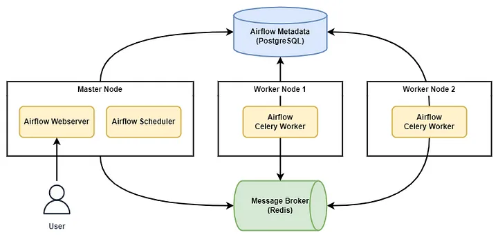

## 목표
AWS상에서 Docker를 이용해서 Airflow 멀티노드를 구상한다.  
AWS, Docker에 대한 이해도를 증가.

## 구성도

## 명령어
### Master Node
1. 설치할 디렉토리로 이동
2. mkdir -p ./dags ./logs ./plugins
3. .env file에 아래와 같은 변수 생성. 상세 값은 참고 링크 참고
    - AIRFLOW_UID=
    - HOSTNAME=
    - FERNET_KEY=
    - SECRET_KEY=
4. docker-compose up airflow-init
5. docker-compose up -d airflow-webserver airflow-scheduler airflow-triggerer flower
6. 로그 생성
    - docker-compose logs --tail=10000 airflow-worker > worker_logs.log

### Worker Node
1. docker-compose up -d airflow-worker

## AWS 설정
1. namenode1 인스턴스 생성
2. airflow 계정 생성
3. rsa 페어 생성을 통한 ssh 로그인 보안 설정
4. /etc/ssh/sshd_config 설정 변경을 통한 hadoop 계정 ssh 접속 허용
5. 이미지 복사를 통한 datanode1, datanode2 인스턴스추가
6. host 등록
7. airflow 실행 (airflow webserver --port 8080, airflow scheduler)
8. port 확인, 보안의 인바운드 규칙 확인

## 참고 링크
### [Airflow Docker 가이드](https://airflow.apache.org/docs/apache-airflow/stable/howto/docker-compose/index.html)

### [Multinode 설정 가이드](https://medium.com/@wikankun/configure-multi-node-airflow-architecture-using-docker-compose-28fc9d2429de)
